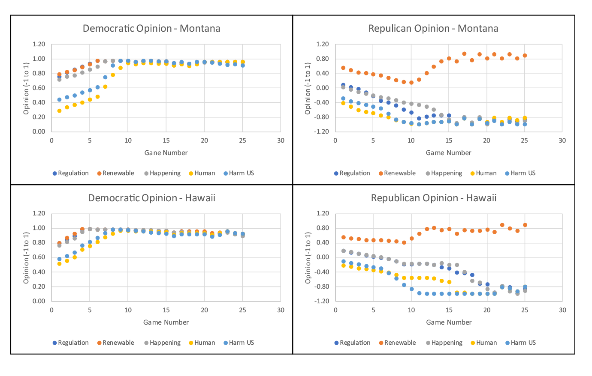

# Game-Theory-Climate-Change-Communication

**Author:** [Andrew Larkin](https://www.linkedin.com/in/andrew-larkin-525ba3b5/)  
**Affiliation:** [Johns Hopkins University, Whiting School of Engineering](https://ep.jhu.edu/)  
**Date Created:** Spring 2018

**Summary**  
Support for climate change regulation significantly differs between the scientific community and general public in the US.  Previous studies suggest partisan politics together with increasingly partisan news media coverage is partly responsible for the divergence between public and scientific opinion.  This project utililzes game theory models to identify best strategies for scientists to use when engaging media to maximmize impact on climate change communication.   
 

**Files**  
- [**GameTheoryClimateChange.ipnb**](GameTheoryClimateChange.ipynb) - Jupyter notebook containing Code to run game theory models and generate output
- [**Actor_Actions.xlsx**](Actor_Actions.xlsx) - Actions chosen for pro and anti climate change actors across 25 games for all 25 states.
- [**PayoffsOverTime.xlsx**](PayoffsOverTime.xlsx) - Change in opinion for republicans and democrats in Montana and Hawaii over 25 games.
- [**DemDeltaOpinionv2.csv**](DemDeltaOpinionv2.csv) - Change in opinion for democratic groups across 25 sequential games and 50 states.
- [**RepDeltaOpinion.csv**](RepDeltaOpinion.csv) - Change in opinion for republican groups across 25 sequential games and 50 states.
- [**Andrew_Larkin_Project_Final_Apr4.docx**](Andrew_Larkin_Project_Final_Apr4.docx) - Climate Change report written for Applied Game Theory course project

**Data Sources**
- State level party affilitations were downloaded from the Pew Internet Reserach Center (http://www.pewforum.org/religious-landscape-study/compare/party-affiliation/by/state)
- State and political party level climate change measures were downloaded from the Yale Center for Climate Change Communication (http://www.pewforum.org/religious-landscape-study/compare/party-affiliation/by/state/)

